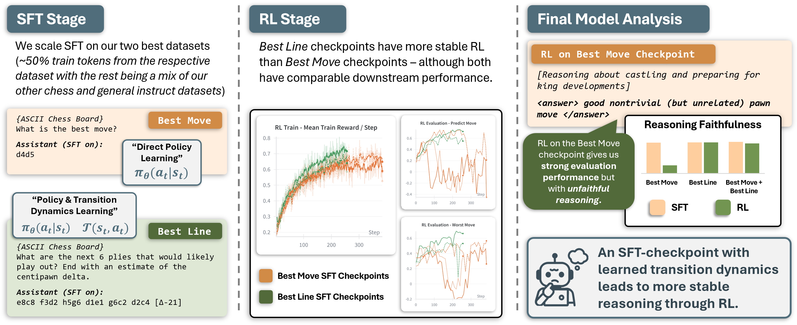
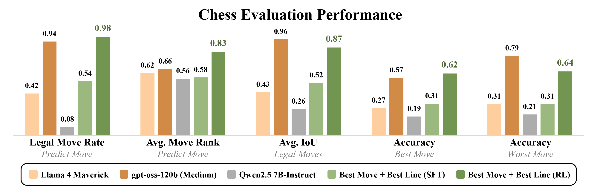

# Reasoning Through Chess: How Reasoning Evolves from Data Through Fine-Tuning and Reinforcement Learning

<p align="center">
  <a href="https://huggingface.co/collections/lucasdino/llm-chess-68a28831deb81e6b1f0a7fb5">🤗 Hugging Face Collection</a> |
  <a href="https://lucasdino.github.io/assets/files/llm_chess_preprint_9-11-2025.pdf">📄 LLM Chess Preprint (PDF)</a>
</p>



This repository provides an implementation of the paper: *Reasoning Through Chess: How Reasoning Evolves from Data Through Fine-Tuning and Reinforcement Learning*.

> *How can you get a language model to reason in a task it natively struggles with?* We study how reasoning evolves in a language model – from supervised fine-tuning (SFT) to reinforcement learning (RL) – by analyzing how a set of theoretically-inspired datasets impacts language model performance in chess. We find that fine-tuning a model to directly predict the best move leads to effective RL and the strongest downstream performance – however, the RL step elicits *unfaithful* reasoning (reasoning inconsistent with the chosen move). Alternatively, training on multi-move trajectories yields comparable downstream performance with faithful reasoning and more stable RL. We show that RL induces a substantial positive shift in the distribution of move quality and reduces hallucination rates as a side effect. Finally, we find several SFT-checkpoint metrics – metrics spanning evaluation performance, hallucination rates, and reasoning quality – to be predictive of post-RL model performance. We release checkpoints and final models as well as training data, evaluations, and code which allowed us to surpass leading open-source reasoning models in chess with a 7B-parameter model


## Paper Overview
We study how reasoning emerges in language models when applied to the domain of chess.  
Our experiments analyze:
- Supervised fine-tuning (SFT) on custom chess datasets  
- Reinforcement learning (RL) with verifiable feedback from chess engines  
- The impact of different data types (e.g., single-move vs. multi-move trajectories) on reasoning faithfulness, hallucination rates, and training stability  
- Which SFT-stage metrics best predict post-RL performance  

Key contributions include:
- Release of chess-specific reasoning datasets  
- Training and evaluation code for SFT and RL  
- Evaluation harness across four tasks: *Best Move, Worst Move, Predict Move, and Legal Moves*  
- Final checkpoints and logs demonstrating strong performance relative to open-source baselines



## Repo Structure

The repository is organized as follows:

```bash
data
  ├── view_data.ipynb
  │     # Notebook to inspect sample data from the `train_data` folder
  ├── sft_datagen_vabp.py / verl_datagen_datamix_10.py
  │     # Scripts for generating SFT / VERL training data
  ├── cleaned
  │   ├── evals
  │   │     # Contains 400 evaluation samples per task
  │   └── train_data
  │         # Sample training data for each dataset type described in the paper.
  │         # For programmatic datasets these are abbreviated (1k samples), but we provide code to generate the full datasets.
  └── raw
      # Subfolders required for the notebooks below
      ├── generate_evals.ipynb
      │     # Generate evaluation datasets (`predictmove`, `bestmove`, `worstmove`, `legalmoves`)
      ├── generate_synthetic_harness.ipynb
      │     # Generate guided synthetic data samples
      ├── generate_vabp.ipynb
      │     # Generate verbalized alpha–beta pruning (VABP) samples
      └── generate_fba.ipynb
            # Generate factual board answering (FBA), best move, and best line data for SFT training

experiment_evals
  # Visualizer for all model generations (SFT and RL checkpoints) referenced in the paper. See the README in this folder for usage.

figures
  # Figures used in the paper

scripts
  # Example scripts and training configurations

utils
  # Helper functions for data generation and evaluation

inference.py
  # Entry point for running model evaluation. See `scripts/sample_scripts/sample_scripts.txt` for usage examples.
```


## Environment Setup

We recommend building with [uv](https://github.com/astral-sh/uv) for fast, reproducible installs.

1. Create a fresh virtual environment:
   ```bash
   uv venv .venv -p 3.11
   source .venv/bin/activate     # Linux / macOS
   .\.venv\Scripts\Activate.ps1  # Windows PowerShell
   ```

2. Install dependencies from `requirements.txt`:
    ```bash
    uv pip install -r requirements.txt
    ```

3. Register a jupyter kernel named `lang-chess`:
    ```bash
    uv run python -m ipykernel install --user --name lang-chess --display-name "Python (lang-chess)"
    ```

4. Download Stockfish ([link](https://stockfishchess.org/download/)) for your platform and move the full 'stockfish' folder inside the 'data/raw' folder.

## Citation
If you find this work useful, please cite:

```bibtex
@inproceedings{dionisopoulos2025reasoningchess,
  title     = {Reasoning Through Chess: How Reasoning Evolves from Data Through Fine-Tuning and Reinforcement Learning},
  author    = {Lucas Dionisopoulos and Nicklas Majamaki and Prithviraj Ammanabrolu},
  booktitle = {Proceedings of the NeurIPS 2025 Workshop on Foundations of Reasoning in Language Models},
  year      = {2025},
}
```

## Licensing
This repository is released under the MIT license (see LICENSE).

It makes use of external datasets:
- **Searchless Chess** dataset (DeepMind), licensed under Apache 2.0  
- **Magpie** dataset (Magpie-Align), licensed under MIT License  

If redistributing or modifying these datasets, please ensure compliance with their respective licenses.